# 📦 Conveyor Sorting System

An AI/OpenCV-based industrial conveyor sorting application for **Arduino App Lab**.

This project provides automated computer vision detection, classification, and counting of **WHITE** and **GREY** cubes placed on a **BLUE** conveyor belt, streaming real-time annotated video and hardware telemetry to a dark web dashboard.

---

## 🗂 Project Structure

```
Conveyor_sorting/
│
├── app.yaml               # Arduino App Lab metadata and environment configuration
├── README.md              # Documentation and system setup guide
│
├── python/
│   └── main.py            # OpenCV vision engine, centroid tracker & Flask REST server
│
├── sketch/
│   ├── sketch.ino         # Non-blocking Arduino firmware for conveyor motor control
│   └── sketch.yaml        # Board profile configuration (Uno, Uno R4)
│
└── assets/
    ├── index.html         # Responsive dark-theme dashboard
    ├── app.js             # Real-time AJAX polling, stream lifecycle & control logic
    └── style.css          # Glassmorphic UI styling with custom counters
```

---

## 🔬 How the OpenCV Detection Works

The system uses a classical computer vision pipeline without heavy machine learning dependencies (no YOLO, TensorFlow, or PyTorch):

```mermaid
flowchart LR
    A[Webcam Frame 640x480] --> B[Extract ROI Zone]
    B --> C[BGR to HSV Conversion]
    C --> D[Blue Belt Masking]
    D --> E[Invert Mask: NOT_BLUE_MASK]
    E --> F[Gaussian Blur & Thresholding]
    F --> G[Morphological Open & Close]
    G --> H[Contour Extraction & Area Filter]
    H --> I[HSV + Grayscale Value Sampling]
    I --> J[Classification: WHITE / GREY]
    J --> K[Centroid Tracking & Single-Shot Count]
```



### 1. Excluding the Blue Conveyor Belt
The conveyor belt occupies the majority of the camera frame. In order to detect cubes without mistaking the belt for an object:
1. The ROI is converted from BGR to HSV color space.
2. A blue color mask is created using `cv2.inRange()` bounded by:
   - Lower HSV: `[90, 50, 40]`
   - Upper HSV: `[135, 255, 255]`
3. `NOT_BLUE_MASK` is generated using bitwise NOT (`cv2.bitwise_not(blue_mask)`).
4. Grayscale candidate contours are masked with `NOT_BLUE_MASK`, eliminating the blue belt surface from object detection.

### 2. Preprocessing & Morphological Filtering
- **Gaussian Blur** (`5x5` kernel) reduces sensor noise and conveyor texture artifacts.
- **Thresholding** isolates candidate objects that are non-blue.
- **Morphological Opening** (`3x3` rectangular kernel) eliminates small specks.
- **Morphological Closing** (`7x7` rectangular kernel) bridges any internal gaps.

### 3. Object Classification Logic (`classify_object`)
For each valid contour, the average HSV values and average grayscale brightness are computed within the contour mask:

* **WHITE Object**:
  - High brightness: Grayscale $\ge 165$ or HSV Value ($V$) $\ge 165$.
  - Low saturation: HSV Saturation ($S$) $\le 75$.
  - Appears significantly brighter than the dark conveyor and background.

* **GREY / DARK GREY Object**:
  - Medium brightness: Grayscale and HSV Value ($V$) between $35$ and $165$.
  - Low/moderate saturation: HSV Saturation ($S$) $\le 85$ (neutral tint).
  - Blue hue guard ensures belt reflection is not misclassified.

---

## 🎯 Detection Stability & Centroid Tracking

To prevent stationary or slow-moving cubes from triggering continuous duplicate counts:
- The system computes Euclidean distance between candidate centroids across frames.
- **Distance Threshold**: `CENTER_DISTANCE_THRESHOLD = 60px`.
- **Cooldown**: `COUNT_COOLDOWN_SECONDS = 2.0s`.
- Each cube is registered with a unique tracking ID and increments the sorting counter **exactly once** upon entering the detection zone.
- When the cube exits the zone or is cleared, its tracked entry is purged.

---

## ⚙️ Adjusting ROI and Detection Parameters

### Via Web Dashboard Sliders
You can adjust the Region of Interest (ROI) bounds and Minimum Object Area live using the UI sliders:
- **ROI X Start / End**: Horizontal window boundaries (default: `10%` to `90%`).
- **ROI Y Start / End**: Vertical window boundaries (default: `25%` to `95%`).
- **Minimum Object Area**: Minimum contour area in pixels (default: `500 px²`).

Click **"Apply Detection Parameters"** to send the updated configuration to Python immediately.

### Via `python/main.py` Constants
Edit the constants at the top of [`python/main.py`](file:///c:/Users/asus/Downloads/Conveyor_Sorting/python/main.py):
```python
CAMERA_INDEX = 0
ROI_X_START = 0.10
ROI_X_END   = 0.90
ROI_Y_START = 0.25
ROI_Y_END   = 0.95
MIN_OBJECT_AREA = 500
MAX_OBJECT_AREA = 50000
```

---

## 🚀 Running the Application

### Method 1: In Arduino App Lab
1. Zip the `Conveyor_sorting` folder or import directly into Arduino App Lab.
2. Connect your Arduino board via USB and select the board port.
3. Launch the App Lab workspace to boot the Python environment and upload the sketch.

### Method 2: Standalone Local Run
1. Install dependencies:
   ```bash
   pip install opencv-python numpy flask pyserial
   ```
2. Start the server:
   ```bash
   python python/main.py
   ```
3. Open your browser to:
   ```
   http://localhost:5000
   ```

> [!NOTE]
> **Simulated Camera Fallback**: If an external webcam is not currently plugged in on index `0`, `main.py` automatically initializes a test simulation mode with animated white and grey cubes traversing a blue conveyor belt. This allows you to verify the entire web UI, API routes, and classification engine immediately without hardware connected.

---

## 🔌 Connecting the External Webcam
1. Connect your USB webcam to the host computer.
2. In `python/main.py`, confirm `CAMERA_INDEX = 0` (or `1` if using a secondary webcam).
3. Ensure good, even top-down lighting above the conveyor belt to prevent heavy shadows.

---

## 🤖 Arduino Firmware & Serial Protocol

The firmware in [`sketch/sketch.ino`](file:///c:/Users/asus/Downloads/Conveyor_Sorting/sketch/sketch.ino) provides non-blocking serial communication at **115200 baud**.

### Configurable Pins
- `MOTOR_ENABLE_PIN` (Pin 5): Controls the conveyor belt motor driver / relay.
- `MOTOR_DIR_PIN` (Pin 6): Conveyor motor direction control.
- `LED_STATUS_PIN` (Pin 13): Flashing heartbeat indicator when conveyor is running.

### Supported Serial Commands
| Command | Action |
|---|---|
| `start_conveyor` | Sets `MOTOR_ENABLE_PIN` HIGH; starts belt |
| `stop_conveyor` | Sets `MOTOR_ENABLE_PIN` LOW; stops belt |
| `sort_white` | Acknowledges WHITE cube sorting trigger |
| `sort_grey` | Acknowledges GREY cube sorting trigger |
| `reset_counters` | Resets internal microcontroller count telemetry |
| `status` | Returns current motor and counter status |

> [!IMPORTANT]
> **Actuator Notice**: The servo motor has been removed for this revision. `sketch.ino` compiles directly without `Servo.h`. The sorting commands (`sort_white`, `sort_grey`) return acknowledgment telemetry to the host until the physical sorting actuator hardware is attached in a future stage.
