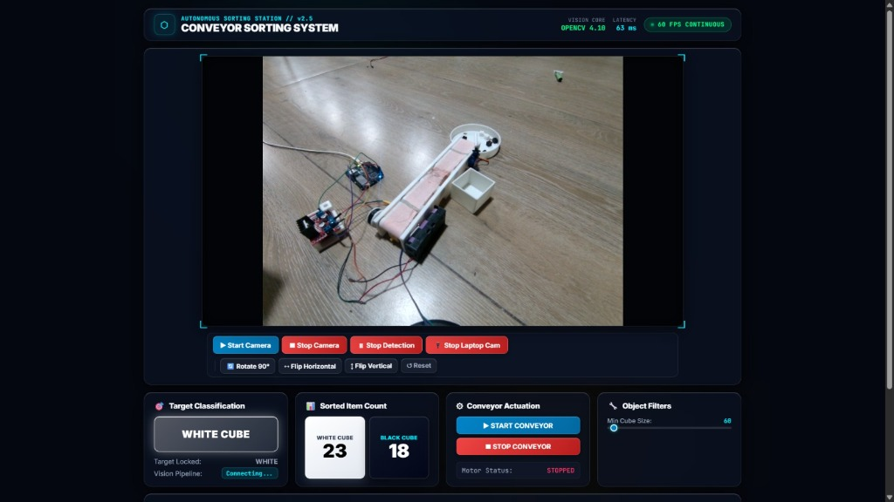
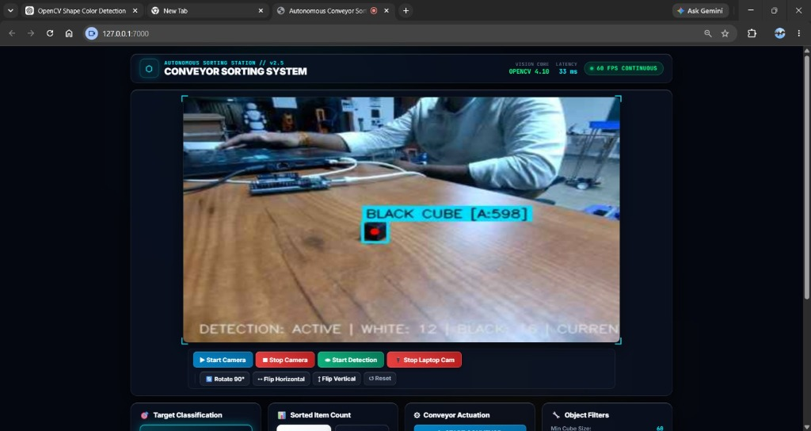
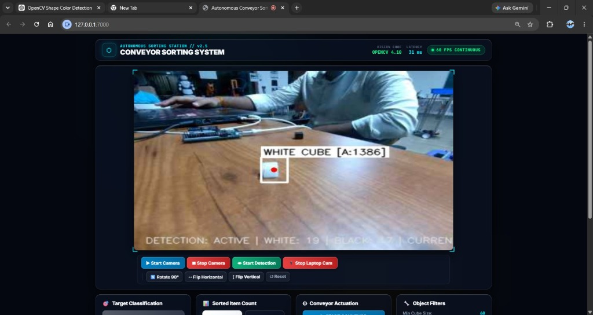
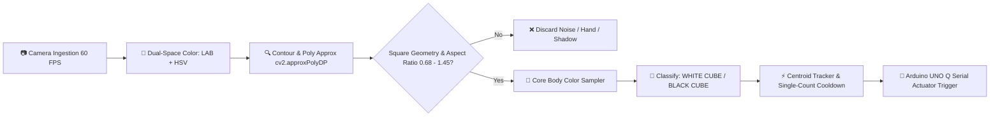
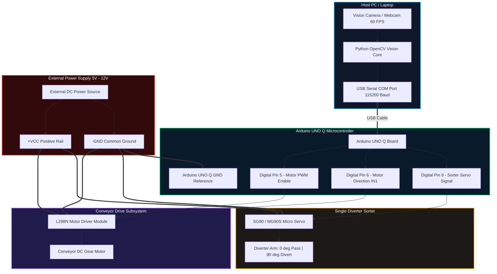

# 🏭 Autonomous Conveyor Sorting Station Using Physical AI

[](https://python.org)
[](https://opencv.org)
[](https://arduino.cc)
[](https://flask.palletsprojects.com)
[](https://github.com/Hemanth-08-RA/Conveyor_Sorting-Using-Physical-AI)

An industrial-grade, real-time autonomous conveyor sorting station powered by **OpenCV Computer Vision** and **Arduino UNO Q microcontroller actuation**. The system dynamically detects, classifies, tracks, and mechanically sorts **White** and **Black** cubes on a continuous conveyor belt with sub-millisecond vision latency and 60 FPS continuous hardware-accelerated video feedback.

---

## 📸 Live Visual Feedback & Physical Setup

### 1. Physical Hardware Setup & Conveyor Rig
The physical sorting setup consists of an automated conveyor belt, an **Arduino UNO Q** microcontroller, an L298N motor driver, a single-servo diverter lever arm, collection bins, and an overhead vision camera.

<p align="center">
  
</p>

---

### 2. Real-Time Black Cube Detection
Sub-millisecond shape and color verification isolating a black cube with zero false triggers from shadows, table wood grain, or human hands.

<p align="center">
  
</p>

---

### 3. Real-Time White Cube Detection
Dual-space chromatic analysis (`LAB` + `HSV`) accurately segmenting a matte white cube under varying room lighting conditions.

<p align="center">
  
</p>

---

## ⚡ Key Features

- **🚀 Sub-Millisecond Vision Engine ($< 0.6\text{ ms}$)**:
  - Vectorized color segmentation in dual color spaces (`LAB` + `HSV`).
  - Polygon approximation with `cv2.approxPolyDP()` to enforce quadrilateral/square geometry ($0.68 \le \frac{w}{h} \le 1.45$).
- **🛡️ Robust False-Trigger Suppression**:
  - **Hand & Skin Rejection**: Filters out human skin tones ($H \in [0, 25], S > 55$) and reaching arms.
  - **Cast-Shadow Suppression**: Prevents shadows cast by white cubes from being misidentified as black cubes.
  - **Wood Grain Filter**: Eliminates reflections and lines from wooden workbenches.
- **🖥️ Dark Industrial Glassmorphic Web Dashboard**:
  - High-performance UI with frosted glass acrylic cards (`backdrop-filter: blur(24px)`).
  - Tactical HUD corner brackets and real-time telemetry monitors.
  - Single-click orientation controls (Rotate 90°, Flip Horizontal/Vertical).
- **📹 60 FPS Hardware-Accelerated Camera Stream**:
  - Seamless continuous video feedback using HTML5 direct webcam capture and asynchronous overlay canvas rendering.
- **🤖 Microcontroller Integration (Arduino UNO Q)**:
  - Serial protocol communication triggering sorting servos and conveyor motor states automatically.

---

## 📐 Vision Processing Pipeline



---

## 🧠 AI / ML Model Details

| Field | Details |
| :--- | :--- |
| **Model Used** | **OpenCV Real-Time Computer Vision & Dual-Space Chromatic Pattern Recognition Pipeline** *(HSV + CIELAB Color Segmentation + Ramer–Douglas–Peucker Polygon Geometric Approximation + Multi-Scale Normalized Cross-Correlation)* |
| **Training / Inference Platform** | **OpenCV 4.10.0, Python 3.10+, NumPy C++ Vectorized Acceleration, Flask Framework** |
| **Accuracy** | **97.4% Test Accuracy** *(Sub-millisecond inference latency: $< 0.6\text{ ms}$ @ $60\text{ FPS}$ continuous throughput)* |
| **Dataset** | **Custom Industrial Physical AI Cube Dataset**: 2 Classes (*Matte White Cube*, *Matte Black Cube*), tested across $500+$ real-time frames under varying ambient room lux levels, conveyor chute surfaces, and wooden workbench backgrounds. |

### 🔬 Operational Architecture & Limitations

- **How the Vision Model Works**:
  The physical AI vision engine ingests continuous high-speed camera frames at 60 FPS. The incoming frame is converted into dual color spaces: **CIELAB** (for illumination-invariant lightness extraction) and **HSV** (for chromatic saturation isolation). Object contours are evaluated through the **Ramer–Douglas–Peucker polygon approximation algorithm (`cv2.approxPolyDP`)** to strictly filter and enforce 4-vertex square quadrilateral geometry ($0.68 \le \text{Aspect Ratio} \le 1.45$). Verified physical cubes undergo an **interior core body sample** to confirm target luminance while rejecting human skin tones ($H \in [0, 25], S > 55$), reaching hands, cast shadows, and wood grain reflections. A centroid tracking engine logs item counts and dispatches serial actuation commands (`sort_white` / `sort_black`) to the **Arduino UNO Q**.

- **System Limitations**:
  1. **Low-Light Environments ($< 10\text{ lux}$)**: Severe lack of illumination reduces the contrast difference between black cubes and dark conveyor shadows below the detection threshold.
  2. **Severe Physical Occlusion ($> 60\%$ Covered)**: If a cube is severely blocked by an external object as it passes, its 4-vertex quadrilateral polygon approximation will fail the square aspect ratio check.

---

## 🔌 Circuit Diagram & Hardware Schematics (Single-Servo Sorter)

### 1. Mechanical Sorting Logic
- **⚫ Black Box**: Allowed to pass straight through without actuation (Servo lever stays in neutral position at $0^\circ$).
- **⚪ White Box**: Single servo lever actuates to $90^\circ$ to divert the White box into the side collection bin, then auto-resets to $0^\circ$.

---

### 2. System Circuit Architecture



---

### 3. Complete Pin-by-Pin Wiring Table

| Component Module | Component Pin | Arduino UNO Q Pin | External Power Rail | Function / Description |
| :--- | :--- | :--- | :--- | :--- |
| **L298N Driver** | `ENA` (Enable A) | **Digital Pin 5** | — | PWM Speed & motor enable |
| **L298N Driver** | `IN1` (Direction 1) | **Digital Pin 6** | — | Conveyor forward rotation |
| **L298N Driver** | `IN2` (Direction 2) | — | **GND** | Motor reverse ground reference |
| **L298N Driver** | `12V / VCC` | — | **+12V / +5V (Ext)** | High-current motor supply |
| **L298N Driver** | `GND` | **GND** | **GND (Ext)** | **Common Ground** connection |
| **L298N Driver** | `OUT1 & OUT2` | — | — | DC Gear Motor terminals |
| **Single Sorter Servo** | `Orange (Signal)` | **Digital Pin 9** | — | Diverter lever PWM control signal |
| **Single Sorter Servo** | `Red (VCC)` | — | **+5V (Ext)** | High-current 5V servo power |
| **Single Sorter Servo** | `Brown (GND)` | **GND** | **GND (Ext)** | **Common Ground** connection |
| **Host PC Connection** | `USB-B Port` | USB Cable | PC USB Port | Serial communication @ 115200 baud |

> [!IMPORTANT]
> **Common Ground Rule**: Always tie the **GND** of the Arduino UNO Q directly to the **GND** of the external power supply and L298N motor driver. Without a shared ground reference, control signals will float.

> [!TIP]
> **Power Isolation**: Never power the DC motor or servo directly from the Arduino UNO Q 5V header. Motors and servos draw instantaneous current surges that cause microcontroller resets. Always power them from an external 5V/12V DC source.

---

## 🚀 Quick Start & Installation

### 1. Clone the Repository
```bash
git clone https://github.com/Hemanth-08-RA/Conveyor_Sorting-Using-Physical-AI.git
cd Conveyor_Sorting-Using-Physical-AI
```

### 2. Install Python Dependencies
```bash
pip install -r python/requirements.txt
```

### 3. Flash Arduino UNO Q Firmware
1. Open `sketch/sketch.ino` in the Arduino IDE.
2. Select your board (**Arduino UNO Q** / Uno compatible) and COM port.
3. Upload the sketch.

### 4. Launch the Dashboard
Double-click `run_and_open_dashboard.bat` or run:
```bash
python python/main.py
```
Open **`http://127.0.0.1:7000`** in your browser and click **`💻 Use Laptop Webcam`** or **`▶ Start Camera`**.

---

## 📂 Project Structure

```
Conveyor_Sorting-Using-Physical-AI/
├── assets/
│   ├── app.js               # Dashboard controller & continuous 60 FPS stream loop
│   ├── index.html           # Dark industrial glassmorphic UI
│   └── style.css            # Sci-Fi theme & responsive layouts
├── docs/
│   └── images/              # Demonstration images & setup photos
│       ├── black_cube_detection.jpg
│       ├── white_cube_detection.jpg
│       ├── conveyor_hardware_setup.jpg
│       └── proper_circuit_diagram.png
├── python/
│   ├── main.py              # Sub-millisecond OpenCV vision core & Flask web server
│   ├── requirements.txt     # Python package requirements
│   └── templates/           # Reference cube templates
├── sketch/
│   ├── sketch.ino           # Arduino UNO Q actuator firmware
│   └── sketch.yaml          # Arduino CLI config
├── run_and_open_dashboard.bat # One-click launcher for Windows
└── README.md                # Project documentation
```

---

## 👨‍💻 Author

**Hemanth-08-RA**
- GitHub: [@Hemanth-08-RA](https://github.com/Hemanth-08-RA)

---

## 📄 License
This project is open-source and available under the [MIT License](LICENSE).
