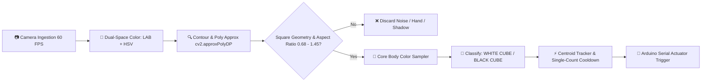

# 🏭 Autonomous Conveyor Sorting Station Using Physical AI

[](https://python.org)
[](https://opencv.org)
[](https://arduino.cc)
[](https://flask.palletsprojects.com)
[](https://github.com/Hemanth-08-RA/Conveyor_Sorting-Using-Physical-AI)

An industrial-grade, real-time autonomous conveyor sorting station powered by **OpenCV Computer Vision** and **Arduino microcontroller actuation**. The system dynamically detects, classifies, tracks, and mechanically sorts **White** and **Black** cubes on a continuous conveyor belt with sub-millisecond vision latency and 60 FPS continuous hardware-accelerated video feedback.

---

## 📸 Live Visual Feedback & Physical Setup

### 1. Physical Hardware Setup & Conveyor Rig
The physical sorting setup consists of an automated conveyor belt, an Arduino UNO microcontroller, an L298N motor driver, dual servo diverter arms, collection bins, and an overhead vision camera.

<p align="center">
  
</p>

---

### 2. Real-Time Black Cube Detection
Sub-millisecond shape and color verification isolating a black cube with zero false triggers from shadows, table wood grain, or human hands.

<p align="center">
  
</p>

---

### 3. Real-Time White Cube Detection
Dual-space chromatic analysis (`LAB` + `HSV`) accurately segmenting a matte white cube under varying room lighting conditions.

<p align="center">
  
</p>

---

## ⚡ Key Features

- **🚀 Sub-Millisecond Vision Engine ($< 0.6\text{ ms}$)**:
  - Vectorized color segmentation in dual color spaces (`LAB` + `HSV`).
  - Polygon approximation with `cv2.approxPolyDP()` to enforce quadrilateral/square geometry ($0.68 \le \frac{w}{h} \le 1.45$).
- **🛡️ Robust False-Trigger Suppression**:
  - **Hand & Skin Rejection**: Filters out human skin tones ($H \in [0, 25], S > 55$) and reaching arms.
  - **Cast-Shadow Suppression**: Prevents shadows cast by white cubes from being misidentified as black cubes.
  - **Wood Grain Filter**: Eliminates reflections and lines from wooden workbenches.
- **🖥️ Dark Industrial Glassmorphic Web Dashboard**:
  - High-performance UI with frosted glass acrylic cards (`backdrop-filter: blur(24px)`).
  - Tactical HUD corner brackets and real-time telemetry monitors.
  - Single-click orientation controls (Rotate 90°, Flip Horizontal/Vertical).
- **📹 60 FPS Hardware-Accelerated Camera Stream**:
  - Seamless continuous video feedback using HTML5 direct webcam capture and asynchronous overlay canvas rendering.
- **🤖 Microcontroller Integration (Arduino UNO)**:
  - Serial protocol communication triggering sorting servos and conveyor motor states automatically.

---

## 📐 Vision Processing Pipeline



---

## 🔌 Hardware Pinout & Wiring

| Component | Arduino Pin | Description |
| :--- | :--- | :--- |
| **Conveyor Motor / Relay** | `Pin 8` | Drives conveyor belt DC motor |
| **White Cube Servo** | `Pin 9` | Diverter arm for White Cube collection bin |
| **Black Cube Servo** | `Pin 10` | Diverter arm for Black Cube collection bin |
| **Serial Baud Rate** | `115200 bps` | High-speed USB communication |

---

## 🚀 Quick Start & Installation

### 1. Clone the Repository
```bash
git clone https://github.com/Hemanth-08-RA/Conveyor_Sorting-Using-Physical-AI.git
cd Conveyor_Sorting-Using-Physical-AI
```

### 2. Install Python Dependencies
```bash
pip install -r python/requirements.txt
```

### 3. Flash Arduino Firmware
1. Open `sketch/sketch.ino` in the Arduino IDE.
2. Select your board (`Arduino UNO`) and COM port.
3. Upload the sketch.

### 4. Launch the Dashboard
Double-click `run_and_open_dashboard.bat` or run:
```bash
python python/main.py
```
Open **`http://127.0.0.1:7000`** in your browser and click **`💻 Use Laptop Webcam`** or **`▶ Start Camera`**.

---

## 📂 Project Structure

```
Conveyor_Sorting-Using-Physical-AI/
├── assets/
│   ├── app.js               # Dashboard controller & continuous 60 FPS stream loop
│   ├── index.html           # Dark industrial glassmorphic UI
│   └── style.css            # Sci-Fi theme & responsive layouts
├── docs/
│   └── images/              # Demonstration images & setup photos
│       ├── black_cube_detection.jpg
│       ├── white_cube_detection.jpg
│       └── conveyor_hardware_setup.jpg
├── python/
│   ├── main.py              # Sub-millisecond OpenCV vision core & Flask web server
│   ├── requirements.txt     # Python package requirements
│   └── templates/           # Reference cube templates
├── sketch/
│   ├── sketch.ino           # Arduino UNO actuator firmware
│   └── sketch.yaml          # Arduino CLI config
├── run_and_open_dashboard.bat # One-click launcher for Windows
└── README.md                # Project documentation
```

---

## 👨‍💻 Author

**Hemanth-08-RA**
- GitHub: [@Hemanth-08-RA](https://github.com/Hemanth-08-RA)

---

## 📄 License
This project is open-source and available under the [MIT License](LICENSE).
